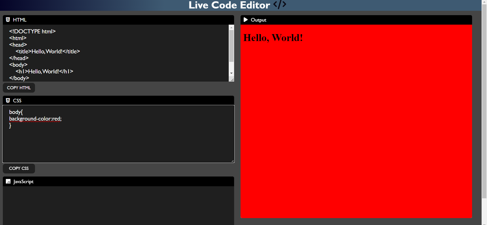

# Live Code Editor


## Overview

The Live Code Editor is a web-based tool that allows you to write and execute HTML, CSS, and JavaScript code in real-time. It provides a convenient interface for coding, live previewing, and even saving your code for future reference.

## Table of Contents

- [Getting Started](#getting-started)
- [Usage](#usage)
- [Code Structure](#code-structure)
- [External Resources](#external-resources)
- [Contributing](#contributing)
- [License](#license)

## Getting Started

1. **Download or Clone the Repository**: Download or clone this repository to your local machine.

2. **Open the HTML File**: Open the `index.html` file in your preferred web browser or a code editor of your choice. This file contains the structure and elements of the Live Code Editor.

3. **Edit Your Code**: Start writing your HTML, CSS, and JavaScript code in the respective text areas provided on the left side of the page.

4. **Live Preview**: As you type or make changes to your code, the live output will be displayed in the right-side iframe in real-time.

5. **Copy Code**: Use the "Copy HTML," "Copy CSS," and "Copy JS" buttons to copy the corresponding code snippets to your clipboard.

6. **Save Your Code**: Click the "Save" button to save your code for future reference. The saved code will be stored locally.

7. **Lock Code**: The "Lock" button allows you to lock the code, preventing further edits. This can be useful when you want to preserve a specific state of your code.

## Usage

Here's an example of the HTML code structure used in this Live Code Editor:

```html
<!DOCTYPE html>
<html lang="en">
<head>
    <!-- Meta information and external resources -->
</head>
<body>
    <!-- Code input fields for HTML, CSS, and JavaScript -->
    <!-- Buttons for copying code, saving code, and locking code -->
    <div class="container">
        <div class="left">
            <!-- HTML, CSS, and JavaScript input fields -->
            <!-- Copy buttons for each code type -->
            <!-- Save and Lock buttons -->
        </div>
        <div class="right">
            <!-- Live output displayed in an iframe -->
        </div>
    </div>
    <script src="./index.js"></script>
</body>
</html>
